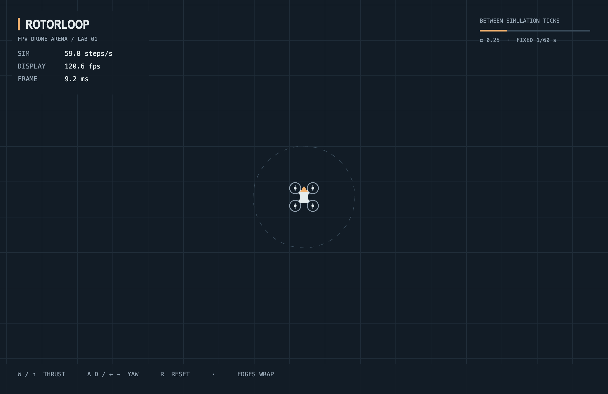
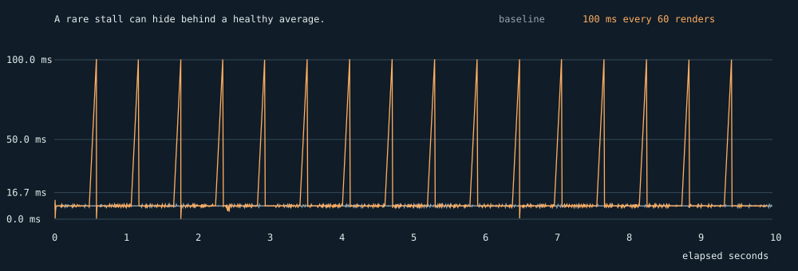

# RotorLoop — FPV Drone Arena

Fly a quadcopter. See the difference between a simulation tick and a rendered frame.

**Lab 01 · JavaScript · Canvas 2D · fixed 60 Hz simulation**

[Український звіт](docs/report.uk.md) · [Підготовка до захисту](docs/defense.md) · [Raw measurements](docs/evidence/RESULTS.md) · [Research & requirement matrix](docs/research.md)



## Start here: a 90-second review

1. **0–25 s:** fly with W and A/D; cross an edge. Watch SIM and DISPLAY count different work.
2. **25–40 s:** hold R, then add W while still holding R. Reset happens once; flight continues. Lose focus and return: no stuck thrust.
3. **40–55 s:** press H to compare the compact HUD and telemetry. Explain the interval strip, steps/frame and live α: a render callback can execute zero or several simulation ticks.
4. **55–70 s:** open [loop.js](src/loop.js). Find the clamp, fixed-step while loop and alpha. The entire production scheduler fits in one small module.
5. **70–90 s:** compare the measurements below. Explain why p95 misses the busy-wait and why genuine CPU 6× barely changed this scene's FPS.

## Run

Use Node 24 (`.nvmrc`; validated on 24.20.0).

```sh
nvm install
nvm use
npm ci
npm run dev
```

Open the local URL printed by Vite. Without nvm, use any existing Node 24 installation. `npm run build` creates `dist/`; `npm run preview` serves that build. No backend or account is needed to play.

| Key | Action |
| --- | --- |
| W / ↑ | Arcade forward thrust |
| A / ←, D / → | Yaw left / right |
| R | Reset once per press |
| H | Toggle loop telemetry; flight continues |

Click the arena to focus. Keyboard controls require a keyboard; the layout resizes to narrow viewports but does not implement the optional touch/gamepad stretch tasks.

## What is deliberately small

The drone is a Canvas X-frame with four motors, an orange nose camera and a rear thrust wash. The landing ring and grid make motion legible. This is a 2D arcade model, not a six-degree-of-freedom FPV simulator: actual multicopter throttle is not forward translation. No fake battery or radio statistics are shown.

There are no runtime libraries, generated image assets, frameworks or physics engines. Vite and Biome are pinned development dependencies. Lab 02–08 features are intentionally absent.

## Two clocks, one simulation

```text
keyboard events → private input Sets
                         ↓
rAF timestamp → accumulator → simulate(1/60), zero or more times
                         ↓
                  previous / current
                         ↓ alpha
               interpolated Canvas frame
```

| Boundary | Responsibility |
| --- | --- |
| [main.js](src/main.js) | Connect input, snapshots, reset, arena and rendering; clean up hot reload |
| [loop.js](src/loop.js) | rAF ownership, start/stop, clamp, accumulator and measured statistics |
| [telemetry.js](src/telemetry.js) | Bounded interval history, distribution summaries and simulation totals |
| [input.js](src/input.js) | Closure state; held vs consuming press edges; repeat/focus cleanup |
| [sim](src/sim) | Immutable plain-data ship integration and arena math, without DOM or Canvas |
| [render](src/render) | Canvas transforms, CSS-pixel/DPR boundary, interpolation and drawing |

`createLoop({ step = 1/60, simulate, render })` returns `start`, `stop`, `getStats`. `integrate(ship, { turn, thrust }, dt)` returns a new `{ x, y, vx, vy, angle, thrust }`. Rendering never advances physics.

SIM and DISPLAY divide actual counts by elapsed time; FRAME is the latest callback interval, **not drawing CPU time**. DISPLAY counts render callbacks, not independently verified physical presentations. The alpha strip shows the actual accumulator fraction.

The incoming frame delta is capped at 0.25 s. Whole fixed steps consume the accumulator; the fractional remainder becomes alpha. Near 60 steps/s is the normal-load target. Hidden tabs and discarded time cannot be promised 60 steps per wall second. Interpolation adds approximately one simulation tick of presentation delay.

## Read the telemetry

The optional Lab 01 frame-time strip is implemented as a chronological history of the last **120 measured intervals**. H toggles its panel; it starts open on desktop and closed on narrow screens. Very short layouts retain the compact HUD. Collection continues when hidden. R resets the drone, while telemetry totals persist until the loop restarts.

| Metric | What it lets you explain |
| --- | --- |
| Interval strip | Uneven pacing that an average FPS can hide. Red means above the **16.7 ms reference**, not a measured dropped frame. Bars clip at 50 ms; numeric summaries retain raw values. |
| Mean / p95 / maximum | The mean describes the window; p95 is the nearest-rank 95th percentile; maximum catches rare stalls p95 may miss. |
| Steps / frame | Zero or multiple fixed ticks within one render callback; rendering and simulation have different clocks. |
| Sim clock / total ticks | Simulated seconds = completed ticks × 1/60; this need not equal elapsed wall time. |
| Clamp lost | Cumulative elapsed time discarded above 250 ms per interval, in seconds. It is not input latency or a dropped-frame count. |
| Alpha | The actual remaining fraction of a tick used for interpolation. |

The first callback establishes the time origin and adds no artificial zero sample. History updates each callback; mean/p95/max refresh after approximately 250 ms of accumulated intervals, so the numbers can briefly lag the moving strip. History covers roughly two seconds at 60 callbacks/s and one at 120, **not a fixed duration**. Storage is bounded and sorting happens only on summary updates.

These metrics were added after the original `lab-01` snapshot. The three experiments below retain their original evidence and baseline revisions; they are not benchmarks of the expanded HUD.

## Where multiplayer enters the course

The [course roadmap](https://github.com/rmalkevy/Programming-Practice-Projects/blob/main/courses/javascript/README.md) introduces a Node.js/WebSocket server and rooms in **Lab 04**, authoritative state with prediction/reconciliation and binary snapshots in **Lab 05**, then public deployment in **Lab 08**. Vite currently serves development files; it is not a multiplayer game server.

The pure simulation is reusable in Node. Future work must give every player the same server-owned arena dimensions (today bounds follow the local Canvas), sequence input commands by tick, and run the authoritative clock on the server. Fixed stepping is a foundation for that work, not a networking implementation.

## Decisions worth asking about

| Problem | Chosen solution | Tradeoff / proof |
| --- | --- | --- |
| Repeated start or restart inside a callback | Idempotent lifecycle plus run generation token | A reviewer reproduced two pending rAF callbacks before the fix; regression tests cover render and simulate restart |
| +179° to −179° | Shortest signed angular difference | Midpoint follows the 2° path; frozen-snapshot renderer test |
| Right edge → left edge | Synchronize the crossed previous coordinate | Avoids a cross-arena streak; sacrifices interpolation for one tick on that axis |
| Retina / monitor changes | CSS world, DPR backing store, absolute setTransform | Resize and DPR-only browser checks; density fallback performs no layout read on ordinary frames |
| Lost keyup after focus change | Clear private input Sets on blur/hidden | Browser and unit checks; R consumes one edge, not keyboard repeat |
| “Same position after five seconds” | Record both clocks, then compare exactly 300 fixed ticks | Separates scheduler endpoints from integration sensitivity |

## Physics tuning

Update order: yaw → acceleration along heading → exponential drag → speed clamp → position using the updated velocity (semi-implicit Euler).

| Constant | Final value | Reason |
| --- | ---: | --- |
| TURN_RATE | 3 rad/s | A full yaw turn takes about 2.09 s; easy to steer with short taps |
| THRUST_ACCELERATION | 480 CSS px/s² | Builds visible speed without teleporting on input |
| DRAG | 1.2 s⁻¹ | Velocity halves in about 0.58 s when coasting; drift remains visible |
| MAX_SPEED | 340 CSS px/s | At 60 Hz, movement stays below 5.67 px per tick |

The planned constants were retained after the actual keyboard smoke: thrust, yaw, coast, reset and wrapping behaved coherently. No unsupported claim of extensive human playtesting is made. Exponential damping is time-based; the complete acceleration/position integrator still has numerical timestep error.

## Experiment 1 — block the main thread

| Run | Callbacks/s | Mean ms | SD ms | p95 ms | p99 ms | Max ms |
| --- | ---: | ---: | ---: | ---: | ---: | ---: |
| rAF baseline | 120.01 | 8.333 | 0.355 | 9.10 | 9.30 | 10.30 |
| 100 ms block / 60 renders | 101.79 | 9.825 | 11.797 | 9.30 | 100.30 | 100.50 |



A once-per-60-frame busy-wait barely moves p95; it dramatically moves p99 and maximum. Main-thread callbacks run to completion: promises, timers and more rAF requests cannot preempt this work. Input callback delay is expected from that mechanism; it was not separately latency-timed. Production contains no busy-wait.

The final HUD sampling window also reacted: baseline **SIM 59.506, DISPLAY 120.004, FRAME 8.3 ms**; blocked **SIM 60, DISPLAY 98, FRAME 99.9 ms**. These short-window readings differ from the full-run averages above. Catch-up preserved the normal simulation cadence while rendering stalled.

## Experiment 2 — setInterval versus rAF

| Run | Callbacks/s | Mean ms | SD ms | p95 ms | p99 ms | Max ms |
| --- | ---: | ---: | ---: | ---: | ---: | ---: |
| rAF foreground | 120.01 | 8.333 | 0.355 | 9.10 | 9.30 | 10.30 |
| setInterval(16) foreground | 62.50 | 16.000 | 0.664 | 17.10 | 17.30 | 17.50 |

During real ~5-second hidden-tab runs, rAF's largest interval was **5032.9 ms**; the timer's was **1000.3 ms**. This Chrome paused rAF and throttled timers. A timer is not aligned to rendering opportunities; 16 ms requests 62.5 callbacks/s, not exactly 60. rAF adapts to the observed display cadence.

## Experiment 3 — variable versus fixed timestep

Real Chrome DevTools CPU throttling, reproducible thrust, five-second wall-time runs:

| Run | Final x | Final y | Steps | Simulated s | Wall s |
| --- | ---: | ---: | ---: | ---: | ---: |
| variable wall-time CPU 1x | 1614.301372 | 300.000000 | 601 | 5.009200 | 5.007300 |
| variable wall-time CPU 6x | 1613.789824 | 300.000000 | 597 | 5.007600 | 5.001300 |
| fixed wall-time CPU 1x | 1610.784130 | 300.000000 | 300 | 5.000000 | 5.004100 |
| fixed wall-time CPU 6x | 1610.784130 | 300.000000 | 300 | 5.000000 | 5.004000 |

Variable normal/throttled distance: **0.511548 px**; fixed: **0.000000 px**. The wall-time endpoints differ slightly, so this alone is not a clean numerical comparison.

At **exactly five simulated seconds**, variable normal/throttled x was **1611.173389 / 1611.217935**, a **0.044546 px** difference. Fixed x was **1610.784130** in both runs after **300 ticks**. All y values were 300.

CPU 6× kept this lightweight scene near 120 callbacks/s. That is why its measured divergence was small. A separately labeled **35 ms render-work probe** reduced cadence to about 28.45 callbacks/s: variable x changed by **1.424528 px** relative to the normal exact-time run; fixed changed by **0.000000 px**. The probe is not presented as a DevTools result.

[Full tables, environment, raw samples and repeat procedure](docs/evidence/RESULTS.md). Experiments use isolated worktrees; only evidence and documentation enter production.

## JavaScript concepts demonstrated

- Tasks and microtasks: synchronous logs, Promise reactions and timers produce `1, 4, 3, 2`; a microtask chain can starve rendering.
- rAF participates in browser rendering updates before repaint; it is neither a timer task nor a microtask.
- ESM provides explicit dependencies, module scope, strict mode, live bindings and deferred module scripts; top-level `this` is undefined.
- Closures retain access to the private input Sets. `const` protects the binding, not the Set's contents; `let` is used only for reassignment.
- Canvas draws locally with save/translate/rotate/restore. Physics is in CSS pixels; DPR is a backing-resolution concern.
- Repeatability requires the same state, per-tick inputs, math and tick count. Fixed dt does not alone guarantee universal cross-platform lockstep.

The [Ukrainian defense notes](docs/defense.md) answer all eight Reflection questions with code-specific examples. [Research notes](docs/research.md) link the primary sources and full requirement matrix.

## Validation and review

```sh
npm run check
npm test
npm run build
```

Original `lab-01` validation on Node 24.20.0: **16 tests passed**, Biome clean, production build passed. Browser checks covered thrust/yaw, held R, wrapping, focus loss, repeat resize, DPR 1/2 and console errors. Original smoke HUD: 60 steps/s and 120 render callbacks/s. Synthetic 60/120 Hz scheduler tests are labeled tests, not hardware evidence.

The telemetry extension passed **all 19 tests**, Biome and the production build on Node 24.20.0, including bounded history, summary math, raw stalls, first-frame exclusion and restart cleanup. Its separate [browser smoke](docs/evidence/telemetry-smoke.json) records functional checks, not monitor benchmarks; see the [method and reproduction command](docs/evidence/telemetry-method.md).

[Independent review and fixes](docs/review.md) · [Browser evidence](docs/evidence/browser-smoke.json)

## Lab checklist

- [x] Vite vanilla, type=module, pinned Biome, .nvmrc
- [x] rAF, clamped fixed-step accumulator, measured HUD
- [x] Closure input with isDown / justPressed
- [x] Pure ship integration, rotation, thrust, drag, speed clamp and wrap
- [x] Previous/current interpolation, short angle path, DPR and resizing
- [x] Three measured experiments and event-loop explanations
- [x] English README, Ukrainian report and all Reflection answers
- [x] Unit tests, browser evidence and independent review
- [x] Optional last-120 frame-time strip with explanatory telemetry

`lab-01` preserves the original validated submission at `0f134a2`. The later telemetry extension is on `main`; the published tag is not silently moved. Inspect either snapshot with `git show lab-01 --stat` or `git show HEAD --stat`.
